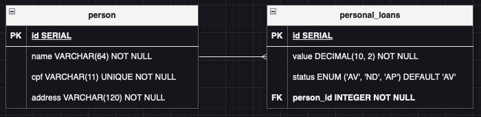

## Code challenge django digitalsys

Esse projeto tem como objetivo resolver um desafio técnico proposto para uma vaga de Django. O desafio técnico deveria usar Django, Django Rest Framework e Celery, além de ter um frontent simples para interagir com a aplicação feita em backend, e por isso criei um projeto em **React** para o frontend. Os projetos para o frontend e o backend se encontram nesse repositório, separados em seus respectivos diretórios.

## Como executar o projeto

Para executar o projeto, basta fazer o **clone** deste repositório, abrir um terminal na raiz do projeto, e executar:

```bash
docker-compose up --build
```

Com o docker executando, basta acessar _**http://localhost:8000/admin**_ de dentro do navegador para ter acesso a tela de admin do Django. Nessa tela, use as seguinte credenciais para ter acesso ao painel de administrador do Django:

```
Username: ADMIN
Password: admin
```

Para acessar o frontend com o formulário de cadastro das propostas, basta acessar _**http://localhost:5173**_ de dentro do navegador.

## Estruturação dos dados no backend



A organização do banco de dados foi feito conforme diagrama mostrado acima. Foi criada uma tabela **person** para armazenar os dados das pessoas que irão solicitar os emprestimos, e uma tabela **personal_loans** que irá armazenar os dados das propostas de emprestimos pessoais. Dessa forma, uma pessoa pode solicitar vários emprestismos, sem a necessidade de repetir os dados das pessoas para cada solicitação.
